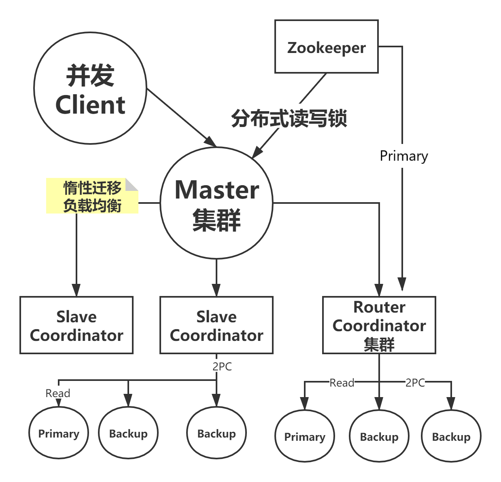

# Distributed Key-value Storage System
Developer: Zhu Wenjie
annotation: please add . before idea, because some dependence is in is for my mistake.
- - - 
## What is it?
A distributed key-value memory storage system,providing basic data sharding based on master/slave architecture.  

## How it works?
### Consistent Hash
Request will be dispatched according to the key, decided by consistent hash map.
### Transfer on Write
When adding slave, the system will re-sharp the data without halting. Router will remember the history.  
TOW means that we only need to transfer the data when writing them.
- Read: Router decide
- Write: Hash decide
### 2PC
All of the data is keep consistent by 2PC, the coordinator will read primary node and write all primary and backup nodes.  
The group of 2PC is marked by group property in Dubbo.
### Dynamic SYNC
Set group.hotfix = 1, the new deployed Backup will automatically find its group's primary node and get SYNCed.
### Dynamic Primary Decision
After disconnecting the primary node, the first of all providers will become new primary node.
### Read Write Lock
Implemented by watching zookeeper node.
### Scalability
- Separate service and data
- All of the services are stateless and can be added or destroyed dynamically. 
- All of the datas have mirrors and can be added or destroyed dynamically.

## Quick Start
Run zookeeper at 2181 port.
### Init
- Set groupid in the property file as 0 or 1, and run DataApplication and Slave Application, then run RouterDataApplication/RouterCoordinatorApplication/MasterApplication twice.  
- Run client to observe the workload.
### Add Slave
- Set groupid in the property file as 2, and run DataApplication and Slave Application.
- Run client to observe the workload. How does it change?

### Destroy Service
- Stop RouterDataApplication/RouterCoordinatorApplication/MasterApplication once.
- Run client to observe the workload. Does it change?

### Add Backup
- Set groupid in the property file as 2 and hotfix as 1, and run DataApplication.
- Run client to observe the workload. Is new backup SYNCed?

### Destory Primary
- Stop group 2 DataApplication which was read.
- Run client(Just read Dont put) to observe the workload. What is the new primary node?

## Material
- [Demo Video](https://www.zhihu.com/zvideo/1261856862208352256)
- [Design](https://zhuanlan.zhihu.com/p/153227894)

## Reference
- zookeeper
- dubbo

